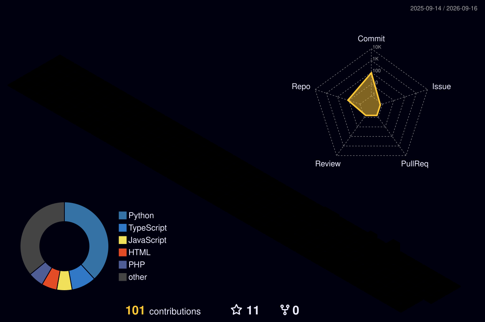

<h1 align="center">Hi, I'm Muhammad Hamza 👋</h1>

<p align="center">
  
</p>

<p align="center">
  <a href="https://hamza-portfolio-00.netlify.app/"></a>
  <a href="https://linkedin.com/in/hamza-khan-9b2841364"></a>
  <a href="mailto:itxhamzakhan45@gmail.com"></a>
  
  <a href="https://www.kaggle.com/mhamzay">
  
</a>
</p>

<p align="center">
  
</p>

---

### 🚀 About Me

```yaml
student:    Computer Science (Honors), UET Mardan — CGPA 3.4, expected 2027
focus:      Full-stack development, mobile apps, applied machine learning
currently:  Building an ML pipeline (Flask API + Flutter frontend)
looking:    Internships & entry-level software roles
fun_fact:   I like turning half-finished ideas into fully working apps
```

---

### 🛠️ Tech Stack

<p align="center">
  
</p>

<details>
<summary><b>📌 Breakdown by category</b></summary>
<br>

**Languages:** C, C++, Python, Dart, PHP, JavaScript
**Mobile & Web:** Flutter, HTML5, CSS3, JavaScript
**Backend & Data:** Firebase, MySQL, Flask
**ML / Data Science:** NumPy, Pandas, scikit-learn, NLTK, TensorFlow/Keras
**Tools:** Git, GitHub, VS Code, Microsoft Office

</details>

---

### 🌟 Featured Projects

<table>
<tr>
<td width="50%">

**📰 Fake News Identifier**
Machine learning application that detects whether news articles are real or fake using natural language processing and text classification. Includes data preprocessing, feature extraction with TF-IDF, model training, evaluation, and an interactive prediction interface.
`Python` `scikit-learn` `Pandas` `NumPy` `NLTK`

</td>
<td width="50%">

**📧 Email Spam Classifier**
End-to-end machine learning project that classifies emails/SMS messages as spam or legitimate. Built using NLP techniques, TF-IDF vectorization, and supervised learning models, with a Flask REST API and Flutter mobile frontend for real-time predictions.
`Python` `scikit-learn` `NLTK` `Flask` `Flutter`

</td>
</tr>

<tr>
<td width="50%">

**🏠 House Price Prediction**
Regression-based machine learning project that predicts house prices from property features such as location, area, bedrooms, and amenities. Includes data cleaning, feature engineering, model comparison, evaluation metrics, and visualization of prediction results.
`Python` `scikit-learn` `Pandas` `Matplotlib` `NumPy`

</td>
<td width="50%">

**🧾 Shop Ledger Management System**
Desktop-based shop management application for tracking customer accounts, sales, purchases, payments, and outstanding balances. Features secure record management, transaction history, search functionality, and automated balance calculations.
`Java` `Java Swing` `MySQL` `JDBC`

</td>
</tr>
</table>

---

## 🏅 GitHub Highlights

<p align="center">
  
  
</p>---

### 📈 Live Metrics Dashboard

<p align="center">
  
</p>

<sub>⬆ Auto-generated every 24h via GitHub Actions — includes stats, languages, activity, and achievements in one render.</sub>

---

### 🌐 3D Contribution Graph


<p align="center">
  
</p>

---

### 📫 Reach Me

<p align="center">
  <a href="mailto:itxhamzakhan45@gmail.com"></a>
  <a href="https://linkedin.com/in/hamza-khan-9b2841364"></a>
  <a href="https://mhamza293.github.io/portfolio"></a>
</p>

---

<p align="center">
  
</p>

<p align="center">
  
</p>

<p align="center"><i>⭐ Thanks for stopping by — feel free to explore my repos!</i></p>
